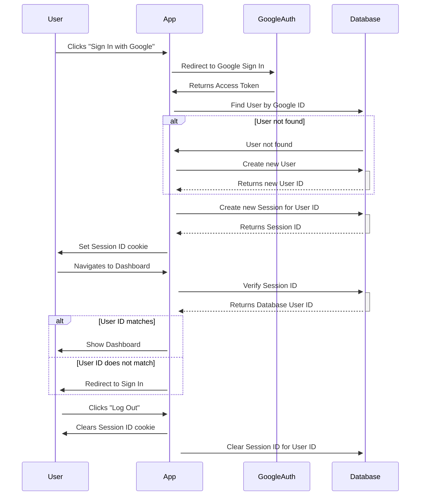

```mermaid
sequenceDiagram
  participant User;
  participant App;
  participant GoogleAuth;
  participant Database;
  User->>+App: Clicks "Sign In with Google";
  App->>+GoogleAuth: Redirect to Google Sign In;
  GoogleAuth->>+App: Returns Access Token;
  App->>+Database: Find User by Google ID;
  alt User not found;
    Database->>+App: User not found;
    App->>+Database: Create new User;
    Database-->>-App: Returns new User ID;
  end;
  App->>+Database: Create new Session for User ID;
  Database-->>-App: Returns Session ID;
  App->>+User: Set Session ID cookie;
  User->>+App: Navigates to Dashboard;
  App->>+Database: Verify Session ID;
  Database-->>-App: Returns Database User ID;
  alt User ID matches;
    App->>+User: Show Dashboard;
  else User ID does not match;
    App->>+User: Redirect to Sign In;
  end;
  User->>+App: Clicks "Log Out";
  App->>+User: Clears Session ID cookie;
  App->>+Database: Clear Session ID for User ID;
```
