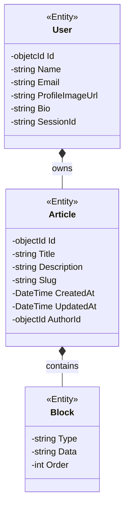

```mermaid

classDiagram
  class User {
    <<Entity>>
    -objetcId Id
    -string Name
    -string Email
    -string ProfileImageUrl
    -string Bio
    -string SessionId
  }
  class Article {
    <<Entity>>
    -objectId Id
    -string Title
    -string Description
    -string Slug
    -DateTime CreatedAt
    -DateTime UpdatedAt
    -objectId AuthorId
  }
  class Block {
    <<Entity>>
    -string Type
    -string Data
    -int Order
  }
  
  User *-- Article : owns
  Article *-- Block : contains


```
